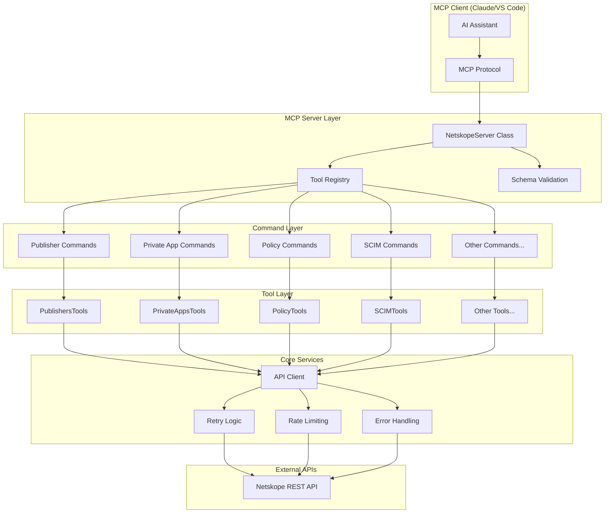

# Server Architecture

The Netskope NPA MCP Server is built on a layered architecture designed for scalability, maintainability, and AI-driven automation.

## Architecture Overview



## Core Components

### 1. MCP Server (`src/server.ts`)

The main server class that orchestrates the entire system:

```typescript
export class NetskopeServer {
  private server: Server;
  private netskope: NetskopeConfig;

  constructor() {
    this.server = new Server(
      { name: 'netskope-npa', version: '6.0.0' },
      { capabilities: { tools: {} } }
    );
    this.setupTools();
  }

  private setupTools(): void {
    // Register all tool categories
    this.registerPublisherTools();
    this.registerPrivateAppTools();
    this.registerPolicyTools();
    // ... other tool registrations
  }
}
```

**Key Responsibilities:**
- Tool registration and lifecycle management
- MCP protocol handling
- Error boundary implementation
- Request/response transformation

### 2. Tool Registration Pattern

Tools are registered using a consistent pattern that ensures type safety and proper error handling:

```typescript
// Publisher tools registration example
Object.entries(publisherCommands).forEach(([_, command]: [string, McpCommand]) => {
  const wrappedHandler = async (args: any, extra: any) => {
    try {
      const result = await command.handler(args);
      return result;
    } catch (error) {
      throw error;
    }
  };
  
  this.server.tool(
    command.name,
    command.schema instanceof z.ZodObject ? command.schema.shape : {},
    wrappedHandler
  );
});
```

### 3. Command Layer Architecture

Each resource type has a dedicated command module that bridges MCP calls to tool implementations:

```typescript
// Example: src/commands/private-apps/index.ts
export const privateAppCommands = {
  createPrivateApp: {
    name: 'createPrivateApp',
    schema: privateAppRequestSchema,
    handler: createPrivateApp
  },
  updatePrivateApp: {
    name: 'updatePrivateApp', 
    schema: privateAppUpdateRequestSchema,
    handler: updatePrivateApp
  }
  // ... other commands
};
```

**Command Layer Features:**
- **Schema Validation**: Every command validates inputs using Zod schemas
- **Error Transformation**: Converts internal errors to MCP-compatible responses
- **Parameter Processing**: Handles MCP parameter objects and extracts values
- **Response Formatting**: Ensures consistent response structure

### 4. Tool Layer Architecture

Tools contain the actual business logic and API interactions:

```typescript
// Example: src/tools/private-apps.ts
export const PrivateAppsTools = {
  create: {
    name: 'createPrivateApp',
    schema: privateAppRequestSchema,
    handler: async (params: PrivateAppRequest) => {
      // Input validation and transformation
      const apiPayload = transformToApiFormat(params);
      
      // API call with retry logic
      const result = await api.requestWithRetry(
        '/api/v2/steering/apps/private',
        { method: 'POST', body: JSON.stringify(apiPayload) }
      );
      
      // Response formatting
      return { content: [{ type: 'text', text: JSON.stringify(result) }] };
    }
  }
};
```

**Tool Layer Features:**
- **API Integration**: Direct integration with Netskope REST APIs
- **Data Transformation**: Converts between MCP and API formats
- **Business Logic**: Implements complex workflows and validations
- **Error Recovery**: Handles API errors and implements retry strategies

## Data Flow Architecture

### Request Flow
1. **MCP Client** → Sends tool request with parameters
2. **Server Layer** → Validates request and routes to command
3. **Command Layer** → Validates parameters against Zod schema
4. **Tool Layer** → Transforms data and calls Netskope API
5. **API Client** → Handles HTTP request with retry logic
6. **Response** → Flows back through layers with proper formatting

### Error Flow
1. **Error Origin** → API error, validation error, or runtime error
2. **Error Capture** → Caught at appropriate layer
3. **Error Transformation** → Converted to standardized format
4. **Error Context** → Enhanced with debugging information
5. **Error Response** → Returned to MCP client with actionable details

## Configuration Architecture

### Environment-Based Configuration
```typescript
// src/config/netskope-config.ts
export const netskopeConfig = {
  baseUrl: process.env.NETSKOPE_BASE_URL,
  token: process.env.NETSKOPE_TOKEN,
  timeout: parseInt(process.env.NETSKOPE_TIMEOUT || '30000'),
  retries: parseInt(process.env.NETSKOPE_RETRIES || '3')
};
```

### Schema-Driven Configuration
All tools use Zod schemas for configuration validation:

```typescript
const configSchema = z.object({
  baseUrl: z.string().url(),
  token: z.string().min(1),
  timeout: z.number().positive(),
  retries: z.number().min(0).max(10)
});
```

## Scalability Features

### 1. Modular Tool System
- Each tool category is independently maintainable
- New tools can be added without affecting existing functionality
- Tools can be selectively enabled/disabled

### 2. Resource-Based Organization
```
src/
  tools/           # Core tool implementations
    private-apps.ts
    publishers.ts
    policy.ts
  commands/        # MCP command wrappers
    private-apps/
    publishers/
    policy/
  types/schemas/   # Zod validation schemas
    private-apps.schemas.ts
    publisher.schemas.ts
    policy.schemas.ts
```

### 3. Caching and Performance
- API response caching for frequently accessed resources
- Request deduplication for identical API calls
- Connection pooling for HTTP requests

### 4. Error Recovery
- Automatic retry with exponential backoff
- Circuit breaker pattern for failing APIs
- Graceful degradation for partial system failures

## Security Architecture

### 1. Token-Based Authentication
```typescript
const apiHeaders = {
  'Netskope-Api-Token': process.env.NETSKOPE_TOKEN,
  'Content-Type': 'application/json'
};
```

### 2. Input Sanitization
All inputs are validated through Zod schemas before processing:

```typescript
const sanitizedInput = inputSchema.parse(rawInput);
```

### 3. Environment Isolation
- Configuration through environment variables
- No hardcoded credentials or URLs
- Secure handling of sensitive data

### 4. Audit Logging
- All API calls are logged with timestamps
- Request/response tracking for debugging
- Error logging with context preservation

## Performance Considerations

### 1. Request Optimization
- Batch operations where possible
- Minimal API calls through smart caching
- Parallel processing for independent operations

### 2. Memory Management
- Streaming responses for large datasets
- Garbage collection optimization
- Memory leak prevention patterns

### 3. Network Efficiency
- HTTP/2 support where available
- Connection reuse and pooling
- Compression for large payloads

## Monitoring and Observability

### 1. Structured Logging
```typescript
console.log(`[${timestamp}] API Request: ${method} ${url}`);
console.log(`[${timestamp}] Response: ${status} (${duration}ms)`);
```

### 2. Metrics Collection
- Request/response times
- Error rates by tool category
- API quota utilization

### 3. Health Checks
- API connectivity verification
- Configuration validation
- Tool registration status

## Extension Points

### 1. Custom Tools
New tools can be added by implementing the `McpTool` interface:

```typescript
interface McpTool {
  name: string;
  schema: z.ZodType<any, any>;
  handler: (args: any) => Promise<McpToolResponse>;
}
```

### 2. Custom Schemas
Extend existing schemas or create new ones:

```typescript
const customSchema = baseSchema.extend({
  customField: z.string().optional()
});
```

### 3. Middleware Support
Add custom middleware for cross-cutting concerns:

```typescript
const withLogging = (handler: Function) => async (args: any) => {
  console.log('Before:', args);
  const result = await handler(args);
  console.log('After:', result);
  return result;
};
```

---

This architecture provides a robust foundation for managing complex Netskope NPA operations through AI-driven automation while maintaining scalability, security, and maintainability.
